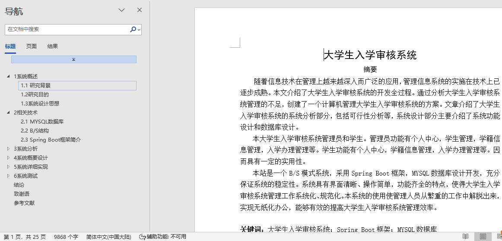
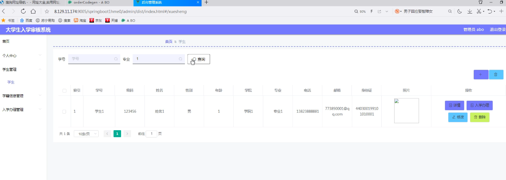
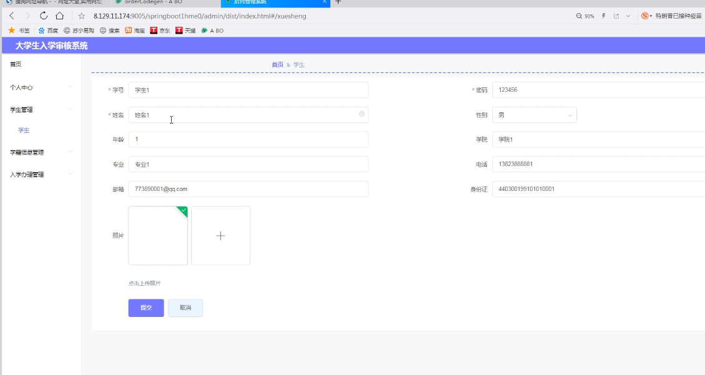
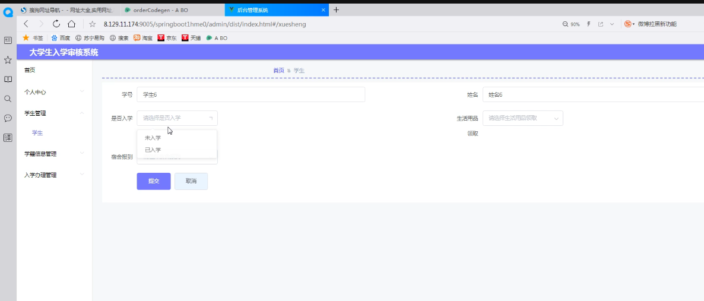
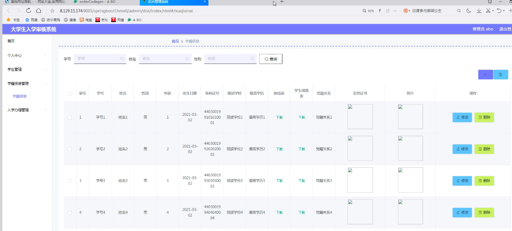
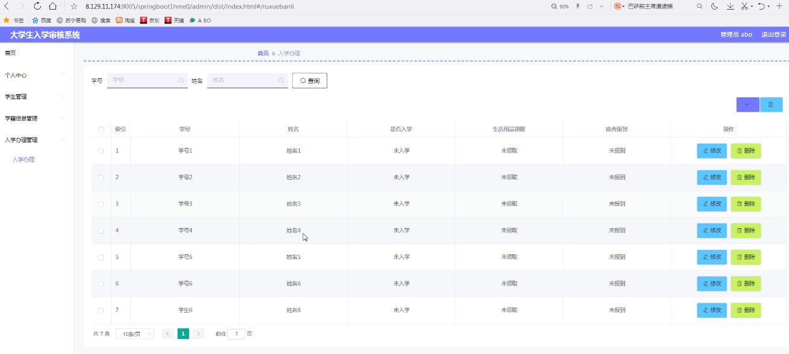
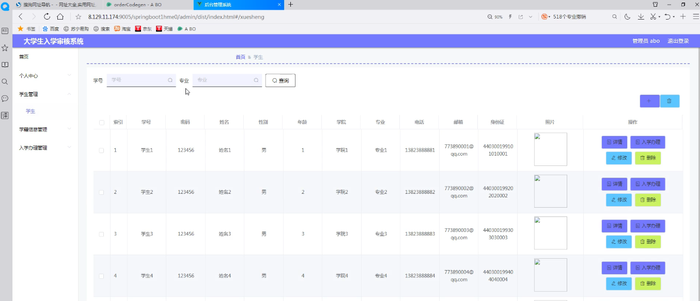

## 基于SpringBoot的大学生入学审核系统(程序+报告)

- <b>完整代码获取地址：从戎源码网 ([https://armycodes.com/](https://armycodes.com/))</b>
- <b>技术探讨、资料分享，请加QQ群：692619798</b> 
- <b>作者微信：19941326836  QQ：952045282</b> 
- <b>承接计算机毕业设计、Java毕业设计、Python毕业设计、深度学习、机器学习</b>
- <b>选题+开题报告+任务书+程序定制+安装调试+论文+答辩ppt 一条龙服务</b>
- <b>所有选题地址 ([https://github.com/YuLin-Coder/AllProjectCatalog](https://github.com/YuLin-Coder/AllProjectCatalog)) </b>

## 项目介绍
基于SpringBoot的大学生入学审核系统，系统包含两种角色：用户、管理员，系统分为前台和后台两大模块，主要功能如下：

### 【管理员】:
①管理员登录：通过验证后，才能进行管理。
②个人信息管理：管理员可对自己的信息进行查看和修改。
③公告通知管理：管理员可对系统首页的通知信息进行增删改查。
④注册用户管理：管理注册用户信息，删除用户。
⑤入学审核管理：管理员可以对当前学生提交的入学申请进行审核，可以对以往相关信息进行增删改查，也可以对查询后的结果进行打印。
⑥查看留言功能：管理员可以查看用户对系统和管理员做出的评价和问题，并回复。
⑦用户信誉积分生成：系统根据用户欠费情况和次数，对用户进行信誉积分生成，信誉积分由系统自动生成，也在用户端显示。

### 【前台】:
①注册登录：使用注册的信息登录，查看个人信息。
②查看个人信息：用户登录可以查看自己的账号信息。
③修改个人信息：用户可以修改个人的基础信息和密码等。
④申请入学信息：点击申请入学管理功能，即可申请账户对应的入学审核信息。
⑤入学申请更换请求：用户若需要更换相关的入学审核信息，即可点击更换入学申请功能，输入相关信息（家庭住址、更换原因、联系方式等），用户等待管理员的审核，若审核不通过，即无法更换入学申请；若审核通过（用户端有提示说审核通过）即可实现信息的更新。
⑥入学信息变更查看：用户点击入学信息变更功能即可查看当前入学信息变更详情。
⑦留言功能：用户可点击留言板即可对系统或者管理员给出评价或问题。
⑧个人信誉度信息查看：管理员端会对用户进行信誉积分生成，用户只能进行查看。

## 项目技术
- 编程语言：Java
- 数据库：MySQL
- 项目管理工具：Maven
- 前端技术：HTML、CSS、JavaScript、Jquery、Vue
- 后端技术：Spring、SpringMVC、MyBatis

## 运行环境
- JDK版本：JDK1.8及以上
- 开发工具：IDEA、Ecplise、Myecplise都可以
- 数据库: MySQL5.7及以上
- Maven：maven3.0及以上
- Node：14.14.0及以上

## 运行截图

